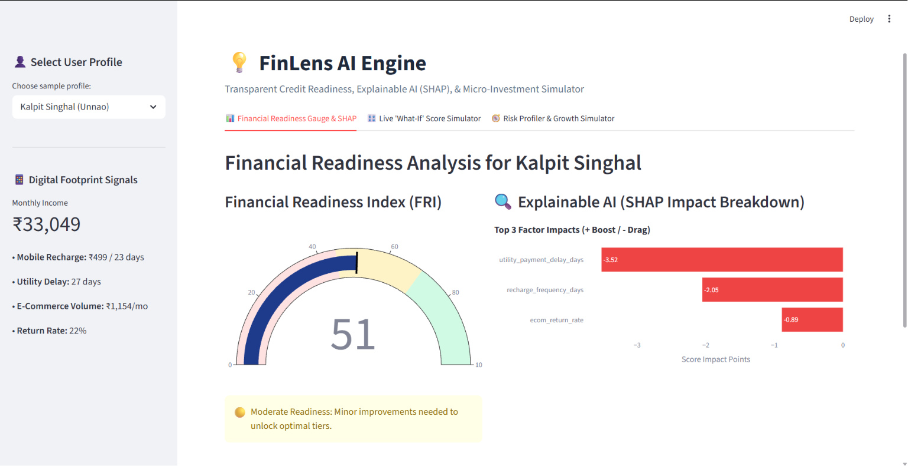
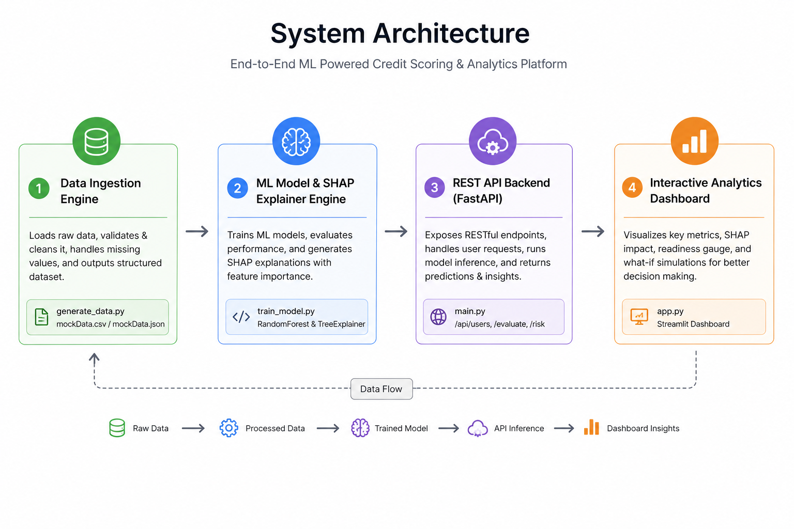

# 💡 FinLens AI — Transparent Financial Readiness & Intelligent Scoring Engine


> **Empowering alternative credit assessment through transparent digital-footprint analytics, explainable ML score breakdowns, and automated micro-investment gating.**

---

## 🖥️ Platform Dashboard Preview



---

## 🌟 Key Features

### 1. 📊 Financial Readiness Index (FRI)

* Evaluates non-traditional daily digital footprints, including mobile recharge regularity, utility payment delay trends, e-commerce volume, and return ratios.
* Generates a **Financial Readiness Index (FRI)** ranging from **0 to 100**.
* Displays the score using a live, animated **Plotly Speedometer Gauge**.

### 2. 🔍 Explainable AI Engine (SHAP)

* Addresses the "black-box" problem of traditional machine-learning credit scoring using **SHAP (SHapley Additive exPlanations)**.
* Calculates the contribution of individual financial and behavioral features.
* Displays a visual breakdown of positive **(+ points)** and negative **(- points)** score drivers.
* Converts mathematical feature impacts into understandable, actionable feedback.

### 3. 🎛️ Real-Time "What-If" Behavioral Simulator

* Allows users to dynamically modify financial and digital habits using interactive UI sliders.
* Recalculates model predictions in real time.
* Demonstrates how changes in financial behavior could potentially improve the user's Financial Readiness Index.

### 4. 🚧 Financial Readiness Gate

* Applies a safety-first risk assessment before generating investment projections.
* Flags potential financial risks such as:

  * Active high-interest loans
  * Insufficient emergency funds
  * Inadequate financial buffers
* Prevents investment suggestions when basic financial-readiness conditions are not satisfied.

### 5. 📈 Micro-Investment Scenario Projections

* Generates interactive **1–5 year growth projections**.
* Simulates three potential market scenarios:

  * **Base Scenario**
  * **Bull Scenario (+3%)**
  * **Bear Scenario (-3%)**
* Uses compound growth calculations to demonstrate possible long-term investment outcomes.

---

## 🏗️ System Architecture



---

## 🛠️ Tech Stack

| Category             | Technology                            |
| -------------------- | ------------------------------------- |
| **Language**         | Python 3.10+                          |
| **Machine Learning** | Scikit-Learn, Random Forest Regressor |
| **Explainable AI**   | SHAP, TreeExplainer                   |
| **Data Processing**  | Pandas, NumPy                         |
| **Model Storage**    | Joblib                                |
| **Backend API**      | FastAPI, Uvicorn, Pydantic            |
| **Frontend UI**      | Streamlit                             |
| **Visualization**    | Plotly Graph Objects                  |

---

## 🚀 Quick Start

Follow these steps to run **FinLens AI** on your local environment.

### Step 1: Clone the Repository

```bash
git clone https://github.com/Luciifer71/FinLens-AI-Transparent-Financial-Readiness-Platform.git
cd FinLens-AI-Transparent-Financial-Readiness-Platform
```

### Step 2: Install Dependencies

```bash
pip install pandas numpy scikit-learn shap joblib fastapi uvicorn pydantic streamlit requests plotly
```

### Step 3: Start the Backend API

Run the following command:

```bash
uvicorn main:app --reload
```

The FastAPI backend should now be available at:

* **Backend API:** `http://127.0.0.1:8000`
* **Swagger Documentation:** `http://127.0.0.1:8000/docs`

### Step 4: Launch the Streamlit Dashboard

Open a **second terminal** in VS Code and run:

```bash
streamlit run app.py
```

The dashboard should open at:

`http://localhost:8501`

---

## 🔌 API Endpoints

| Method | Endpoint                  | Description                                                      |
| ------ | ------------------------- | ---------------------------------------------------------------- |
| `GET`  | `/`                       | API health check and platform metadata                           |
| `GET`  | `/api/users`              | Fetch sample user profiles from the dataset                      |
| `POST` | `/api/evaluate-readiness` | Calculate FRI score and generate SHAP explainability breakdown   |
| `POST` | `/api/assess-risk`        | Evaluate financial readiness and generate investment projections |

---

## 📁 Project Structure

```text
FinLens-AI-Transparent-Financial-Readiness-Platform/
│
├── assets/
│   ├── Dashboard.png                 # Streamlit dashboard preview 
│   └── System_Architecture.png       # System architecture diagram

│
├── data/
│   ├── mockData.csv           # Dataset used for model training
│   └── mockData.json          # User profiles used for API simulation
│
├── models/
│   ├── credit_model.pkl       # Trained Random Forest model
│   └── shap_explainer.pkl     # Pre-computed SHAP TreeExplainer
│
├── generate_data.py           # Synthetic data generation script
├── train_model.py             # ML model training and SHAP engine
├── main.py                    # FastAPI REST backend
├── app.py                     # Streamlit analytics dashboard
├── README.md                  # Project documentation
└── .gitignore                 # Git ignore configuration
```

---

## 🧠 How It Works

FinLens AI follows the following processing pipeline:

**Digital Financial Footprints → Data Processing → ML Model → Financial Readiness Index → SHAP Explainability → Risk Gate → Investment Simulation**

### 1. Digital Financial Footprints

The system analyzes alternative financial indicators such as payment behavior, mobile recharge patterns, e-commerce activity, and other simulated digital financial signals.

### 2. Machine Learning Prediction

The processed features are passed into a **Random Forest Regressor**, which generates the user's Financial Readiness Index.

### 3. Explainable AI

The **SHAP TreeExplainer** determines how individual features contributed positively or negatively to the generated score.

### 4. Behavioral Simulation

Users can modify financial behaviors using interactive controls and immediately observe how those changes affect their predicted score.

### 5. Financial Readiness Assessment

The system evaluates whether fundamental financial conditions are satisfied before proceeding to investment projections.

### 6. Investment Projection

Eligible users can explore potential **1–5 year investment outcomes** across Base, Bull, and Bear market scenarios.

---

## 🎯 Project Objective

Traditional credit-scoring systems rely heavily on formal credit histories. This can make financial assessment difficult for individuals with limited or no conventional credit records.

**FinLens AI explores an alternative approach to financial-readiness assessment.**

Instead of generating an unexplained score, the platform focuses on transparency by helping users understand:

* **Why** they received their Financial Readiness Index
* **Which factors** positively or negatively affected the score
* **How** behavioral changes could potentially improve financial readiness
* **Whether** basic financial conditions are satisfied before considering investments

---

## ⚠️ Disclaimer

> **FinLens AI is an educational prototype and proof-of-concept.**

The Financial Readiness Index, risk assessments, and investment projections generated by this application should **not** be interpreted as official credit scores, lending decisions, financial advice, or investment recommendations.

A production financial system would require validated real-world datasets, regulatory compliance, model fairness testing, security controls, privacy safeguards, and professional financial oversight.

---

## 🔮 Future Improvements

* Real-world financial API integration
* Advanced behavioral feature engineering
* Model fairness and bias evaluation
* User authentication and profile management
* Persistent database integration
* Personalized financial-improvement recommendations
* Advanced investment risk profiling
* ML model monitoring and retraining
* Cloud deployment
* Scalable backend infrastructure

---

## 👨‍💻 Development

FinLens AI demonstrates the intersection of:

**FinTech × Machine Learning × Explainable AI × Financial Inclusion**

The project focuses on developing a transparent and interpretable financial-readiness assessment platform using alternative financial indicators and explainable machine learning.

---

## ⭐ Support

If you find this project useful or interesting, consider giving the repository a **⭐ Star**.

Contributions, suggestions, and feedback are welcome.

---

<p align="center">
  <strong>FinLens AI</strong><br>
  Transparent Financial Readiness through Explainable AI
</p>
